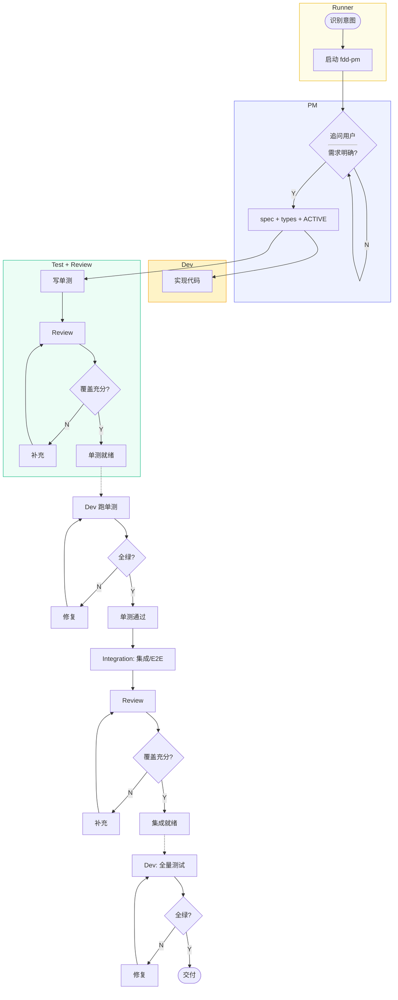
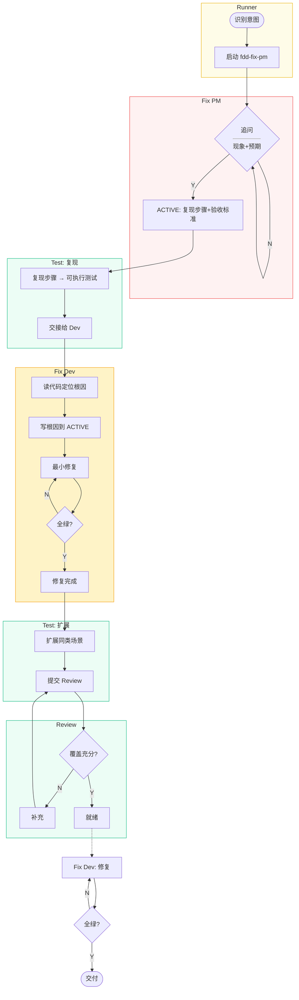

# Skills

> `pi install git:github.com/0xlxx/skills`

## FDD 形式化驱动开发

8 个 agent，4 个 fdd skill，通过 `plans/ACTIVE.md` 交接状态。`fdd-runner` 统一编排，子 agent 通过 `inherit_context` 继承上下文。

### 新功能开发流程



### Bug 修复流程



### Agent 职责

| Agent | 场景 | 职责 | 边界 |
|-------|------|------|------|
| `fdd-runner` | 编排 | 识别意图、按流程调度子 agent、跟踪 ACTIVE 状态 | 不写代码，不分析需求 |
| `fdd-pm` | 新功能 | 需求规约 + API 设计 + 类型定义 | 不写实现，不写测试，不猜需求 |
| `fdd-fix-pm` | Bug | 厘清现象、复现步骤、预期行为、验收标准 | 不分析根因，不写修复方案 |
| `fdd-dev` | 新功能 | 实现功能，跑测试修复到全绿 | 不写测试，不读上游源码 |
| `fdd-fix-dev` | Bug | 诊断根因、最小修复、回归验证 | 不改测试，不引入回归 |
| `fdd-test` | 两者 | 新功能单测 / Bug 复现用例(串行) + 同类扩展(送审) | 不读实现，不跑测试 |
| `fdd-review` | 两者 | 审查测试覆盖（单测 + 集成/E2E + Bug扩展） | 不读实现，不改测试 |
| `fdd-integration` | 新功能 | 集成测试优先，必要时写 E2E | 不跑测试，不重复单测 |

### Skills 重用

| Skill | 服务 Agent |
|-------|-----------|
| `fdd-pm` | fdd-pm, fdd-fix-pm |
| `fdd-dev` | fdd-dev, fdd-fix-dev |
| `fdd-test` | fdd-test, fdd-review |
| `fdd-runner` | fdd-runner |

### 状态节点

| 状态 | 流程 | 谁更新 | 下一动作 |
|------|------|--------|----------|
| 需求确认中 | 新功能 | fdd-pm | 问清后输出规约 |
| 待复现 | Bug | fdd-fix-pm | Test 写复现用例 |
| 复现就绪 | Bug | fdd-test | fdd-fix-dev 诊断根因 |
| 开发中 | 两者 | PM/Test | Dev/Test 并行（新功能）或 Dev 诊断（Bug） |
| 待 Review | 两者 | fdd-test | fdd-review 审查 |
| 单测就绪 | 新功能 | fdd-review | fdd-dev 跑单测 |
| 单测通过 | 新功能 | fdd-dev | fdd-integration 集成测试 |
| 修复完成 | Bug | fdd-fix-dev | fdd-test 扩展同类场景 |
| 集成/E2E 待 Review | 新功能 | fdd-integration | fdd-review 审查 |
| 集成就绪 | 新功能 | fdd-review | fdd-dev 全量测试 |
| 已完成 | 两者 | Dev | 交付 |
| ⚠️ 审查未通过 | 两者 | fdd-review | 补充 → 再审 |

### 调用方式

**一句话启动**：

```
启动 fdd-runner，分析这个新功能：XXX
启动 fdd-runner，修这个bug：点击保存白屏
```

Runner 会自动调度后续所有子 agent。

**或手动分步调用**：

新功能：
```bash
# 1. PM
Agent({ subagent_type: "fdd-pm", description: "需求分析", prompt: "分析XXX功能" })

# 2. 并行
Agent({ subagent_type: "fdd-dev", description: "实现", prompt: "根据规约实现", run_in_background: true })
Agent({ subagent_type: "fdd-test", description: "单测", prompt: "写单元测试", run_in_background: true })

# 3-6 Review + 修复 + 集成 + Review + 修复
Agent({ subagent_type: "fdd-review", description: "审查单测", prompt: "检查覆盖" })
Agent({ subagent_type: "fdd-dev", description: "修复", prompt: "跑测试修复到全绿" })
Agent({ subagent_type: "fdd-integration", description: "集成测试", prompt: "写集成/E2E测试" })
Agent({ subagent_type: "fdd-review", description: "审查集成", prompt: "检查覆盖" })
Agent({ subagent_type: "fdd-dev", description: "修复", prompt: "全量测试修复" })
```

Bug 修复：
```bash
# 1. PM
Agent({ subagent_type: "fdd-fix-pm", description: "Bug分析", prompt: "分析这个bug的现象和预期" })

# 2. Test 写复现用例（串行，不Review）
Agent({ subagent_type: "fdd-test", description: "复现测试", prompt: "将PM确认的复现步骤写成可执行测试" })

# 3. Dev 诊断根因并修复
Agent({ subagent_type: "fdd-fix-dev", description: "诊断修复", prompt: "读ACTIVE+复现用例，定位根因，修复到全绿" })

# 4. Test 扩展同类场景 + Review + Dev 修复
Agent({ subagent_type: "fdd-test", description: "扩展测试", prompt: "补充同类场景的测试" })
Agent({ subagent_type: "fdd-review", description: "审查", prompt: "检查扩展测试覆盖" })
Agent({ subagent_type: "fdd-fix-dev", description: "修复", prompt: "修复到全绿" })
```

## 通用 Skills

| Skill | 说明 |
|-------|------|
| `api-design` | API 设计原则：渐进式增强、框架无关、DX 优先、原子化 |
| `essence-first` | 本质优先解释法：先给上下文和本质，不堆砌细节 |
