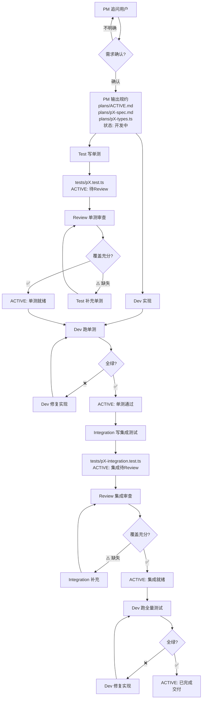

# Skills

> `pi install git:github.com/0xlxx/skills`

## FDD 形式化驱动开发

六个 agent 协作，通过 `plans/ACTIVE.md` 交接状态。

### 完整流程



### Agent 职责

| Agent | 职责 | 输入 | 输出 | 边界 |
|-------|------|------|------|------|
| `fdd-pm` | 需求规约 + API 设计 + 类型定义 | 用户目标、上游源码（必须追问确认后才写规约） | `plans/ACTIVE.md`、规约、类型文件 | 不写实现，不写测试，不猜需求 |
| `fdd-dev` | 实现功能，跑测试修复到全绿 | PM 规约 | `src/pX-*.ts`，更新 ACTIVE | 不写测试，不读上游源码 |
| `fdd-test` | 编写单元测试，配合 Review 补充 | PM 规约 | `tests/pX.test.ts`，更新 ACTIVE | 不读实现代码 |
| `fdd-review` | 审查测试覆盖（单测 + 集成） | 规约 + 测试文件 | `plans/pX-test-review.md`，更新 ACTIVE | 不读实现，不改测试 |
| `fdd-integration` | 编写集成测试 | 规约 + 实现代码 | `tests/pX-integration.test.ts`，更新 ACTIVE | 不跑测试，不重复单测 |

### 状态节点

| 状态 | 谁更新 | 下一动作 |
|------|--------|----------|
| 需求确认中 | PM（追问用户） | 问清楚后输出规约 |
| 开发中 | PM | Dev + Test 并行开始 |
| 待 Review | Test | Review 审查单测 |
| 单测就绪 | Review | Dev 跑单测 |
| 单测通过 | Dev | Integration 写集成测试 |
| 集成测试待 Review | Integration | Review 审查集成 |
| 集成就绪 | Review | Dev 跑全量测试 |
| 已完成 | Dev | 交付 |
| Review ⚠️ | Review | Test/Integration 补充 → Review 再审 |

### 调用方式

```bash
# 1. PM 出规约
Agent({ subagent_type: "fdd-pm", description: "需求分析", prompt: "分析XXX功能" })

# 2. 并行启动 Dev 和 Test
Agent({ subagent_type: "fdd-dev", description: "实现", prompt: "根据规约实现", run_in_background: true })
Agent({ subagent_type: "fdd-test", description: "单测", prompt: "根据规约写单元测试", run_in_background: true })

# 3. Review 审查单测覆盖（循环直到 ✅）
Agent({ subagent_type: "fdd-review", description: "审查单测", prompt: "检查单元测试覆盖" })

# 4. Dev 跑测试修复
Agent({ subagent_type: "fdd-dev", description: "修复", prompt: "运行 pnpm test，修复到全绿" })

# 5. 单测全绿后，写集成测试
Agent({ subagent_type: "fdd-integration", description: "集成测试", prompt: "编写集成测试" })

# 6. Review 审查集成测试
Agent({ subagent_type: "fdd-review", description: "审查集成", prompt: "检查集成测试覆盖" })

# 7. Dev 跑全量测试修复
Agent({ subagent_type: "fdd-dev", description: "修复集成", prompt: "运行全部测试并修复到全绿" })
```

## 通用 Skills

| Skill | 说明 |
|-------|------|
| `api-design` | API 设计原则：渐进式增强、框架无关、DX 优先、原子化 |
| `essence-first` | 本质优先解释法：先给上下文和本质，不堆砌细节 |
